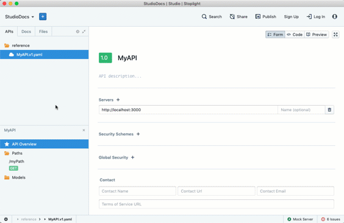
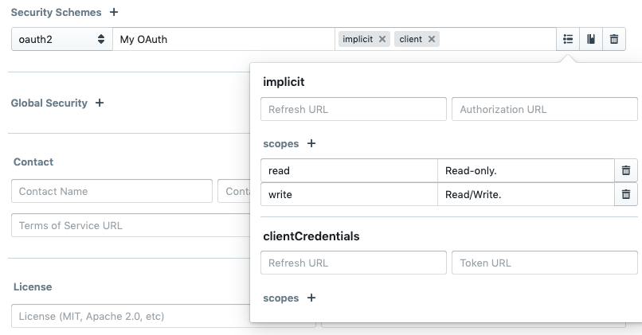
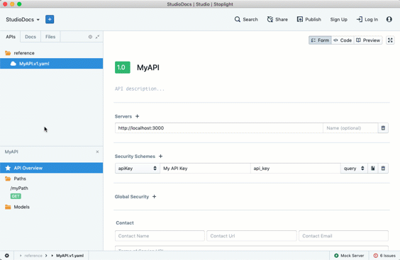
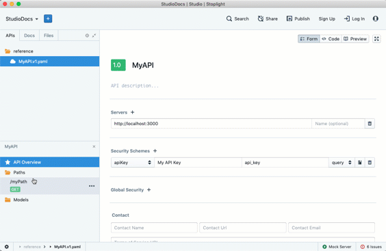

# API Security

The OpenAPI specification allows API designers to define authentication and authorization as part of their machine-readable API description through security scheme definitions and security requirements. Stoplight supports all OpenAPI security features.

A security scheme is a global definition with a name that designates an authentication method available for the API. It is possible to define multiple schemes if, for example, an API supports both Basic Authentication and OAuth. There can even be various schemes of the same type.

A security requirement, on the other hand, can exist both globally for the entire API or on an operation level. It matches the API as a whole or the individual API operation to one or more of the previously defined security schemes. Developers can use this to specify different levels of authorization explicitly, for example, by making read requests available without authentication, but requiring OAuth for write requests.

## Creating Security Schemes

You can define security schemes by following these steps:

1. Open **API Overview** for your API.
1. Click the **+** (plus) icon that appears next to _Security Schemes_.
1. Select the scheme type in the leftmost dropdown menu.
1. Give your scheme a name in the key field. This key must be unique within the API and will be used to reference the scheme in a security requirement.
1. Specify other settings depending on the scheme type, as explained below.
1. Optionally, click the description button (icon on the right) to add a human-readable description with more information about your scheme.

### API Keys

For API keys, select the _apiKey_ scheme type. An API key is a single token sent to the API server that the user has retrieved through an out-of-band mechanism. API keys can be a query parameter, a custom HTTP header, or a cookie.

Use the right dropdown to toggle between _query_, _header_, and _cookie_ and use the name textbox to enter the query, cookie, or header name, respectively.

When designing a new API with API Keys, we recommend the following:

- Use _cookie_ when a web application uses your API in the browser, and you can use cookies for session management.
- Use _query_ when your API is mostly exposing public data or doesn't have strict security constraints and may be used in environments where developers can only specify a URL but no custom headers.
- In all other cases, use _header_ as the best practice that follows proper HTTP semantics.

### HTTP Authentication

For HTTP authentication, select the _http_ scheme type. HTTP authentication uses the standard HTTP _Authorization_ header defined in [RFC7235](https://tools.ietf.org/html/rfc7235).

Use the right dropdown to switch between the different HTTP authentication schemes. OpenAPI and, by extension, Stoplight support all the [schemes registered at IANA](https://www.iana.org/assignments/http-authschemes/http-authschemes.xhtml). Further configuration is neither necessary nor possible.

While OpenAPI supports the different variants of HTTP authentication, the majority of APIs use _basic_. With basic authentication, an API client sends the combination of a username and a password in the Authorization header. The method for retrieving the username and password is not part of the OpenAPI description.

### OAuth 2

For OAuth 2, select the _oauth2_ scheme type. OAuth is an open authentication standard defined by [RFC6749](https://tools.ietf.org/html/rfc6749) and [RFC6750](https://tools.ietf.org/html/rfc6750). OAuth also uses the standard HTTP _Authorization_ header to send a credential known as bearer token but also defines various flows for retrieving this bearer token. You can enter the configuration for the flows into your OpenAPI specification, and various OpenAPI tools can use this information to assist the user in going through them.

Hint: If you are documenting an API that still uses OAuth 1, select the _http_ scheme type and then _oauth_ as a subtype instead.

Once selecting _oauth2_, you will see a flows input field into which you can enter one or more of the following flow types: _implicit_, _password_, _clientCredentials_, and _authorizationCode_. An autocomplete dropdown appears as soon as you click in the flows field.

A button for OAuth 2 Flow Settings is located next to the input. Click it to open a popup where you can enter additional information for the selected flows:

- For _implicit_, you can provide Refresh URL and Authorization URL.
- For _password_ and _clientCredentials_, you can provide Refresh URL and Token URL.
- For _authorizationCode_, you can provide Refresh URL, Authorization URL, and Token URL.

The Refresh URL is only required if your OAuth server issues refresh tokens.

For each of the flows, you can also add scopes. Scopes specify certain access rights for your API. For each scope, you can enter a name and a description. You should add at least one scope for your API, but you can add as many as you want.

### OpenID Connect

For OpenID Connect select the _openIdConnect_ scheme type. OpenID Connect is a set of specifications that extend OAuth 2. Most relevant in the context of OpenAPI is a feature specified in [OpenID Connect Discovery](https://openid.net/specs/openid-connect-discovery-1_0.html) that allows dynamic retrieval of OpenID provider information, including OAuth 2 attributes like URLs, supported flows, and scopes.

After selecting _openIdConnect_, provide the OpenID Connect URL in the respective field.

## Specifying Global Security

You can specify global security requirements in the API Overview, right below the definition of the security schemes. The following applies for global security requirements:

- If you define multiple, the API consumer must follow one of them.
- Global security applies to all API operations unless you define a specific security requirement for them.

To add a requirement:

1. Open **API Overview** for your API.
1. Click the **+** (plus) icon that appears next to _Global Security_.
1. Click **+ Add global security**.
1. Choose your security scheme in the dropdown menu.
1. If the selected security scheme uses _oauth2_ and you have defined scopes, optionally enter the scopes required for API access in the scopes input field. Note that _all_ scopes must be authorized in the flow.

## Specifying Security Requirements for Operations

You can specify security requirements for every operation in your API. If you do so, you override any global security requirement you may have specified. If you do not specify a security requirement for an operation and there are no global security requirements, it means that this operation does not require authentication.

To add a requirement to an operation:

1. Choose the path under _Paths_ and click on the respective HTTP verb to select the desired operation.
1. Click the **+ Security** button.
1. Click **+ Add operation security**.
1. Choose your security scheme in the dropdown menu.
1. If the selected security scheme uses _oauth2_ and you have defined scopes, optionally enter the scopes required for access to the specific operation in the scopes input field. Note that _all_ scopes must be authorized in the flow.

It is also possible to explicitly remove a global security requirement if you want to describe an operation that needs no authentication. To do so:

1. Choose the path under _Paths_ and click on the respective HTTP verb to select the desired operation.
1. Click the **+ Security** button.
1. Click **Disable security for operation**.